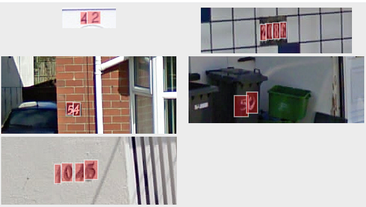

+++
title = "Creating your first assessment capability"
description = "A tutorial on how to create your first assessment capability, add it to an agent and run in an assessment process"
date = 2021-05-01T08:00:00+00:00
updated = 2021-05-01T08:00:00+00:00
draft = false
weight = 400
sort_by = "weight"
template = "docs/page.html"

[extra]
lead = "A tutorial on how to create your first assessment capability, add it to an agent and run in an assessment process"
toc = true
top = false
+++

## Overview

The following tutorial will walk you through creating an *Assessment Capability* in
Highlighter. Each step in this tutorial can by carried out in you Highlighter
account. Although we will be building a toy example, the tutorial wll link to
other explanations/references as needed.

## Prerequisite

1. **Labelled data**: For this tutorial we will be using a Street Number
detection dataset. To import it into your account click [here](ToDo)

## What Is An *Assessment Capability*

> Assessments tasks are sub-tasks of a larger assessment process that an organisation wishes to carry out.

More information on Capabilities [here](../concepts/capabilities.md#assments)

## Steps

1. [Identify The Taxonomy](#identify-the-taxonomy) and create as needed
2. [Create A Model](#create-a-model) that outputs the desired taxa
3. ...

## Identify The Taxonomy

When working in an extablished account you may have an existing taxonomy
defined. In this case you may be able to skip to the [Create A
Model](#create-a-model) step.

For this tutorial we will be creating a street number detector. The detector
will take images as input and return an enum attribute indicating the digit
(0-9) and a pixel location attribute. For example:

For this we will need to create 10 object classes in Highlighter to represent each
digit. 

1. Click the *Taxonomy* tab on the Highlighter side bar
2. Click the *New Object Class* button
3. Fill in the form (using Zero as an example):
  - `Name = Zero`
  - `Description = The digit zero`
  - `Color = YOU CHOOSE`
  - `Include in projects by default? = UNCHECK`
4. Click *Save Object Class*

