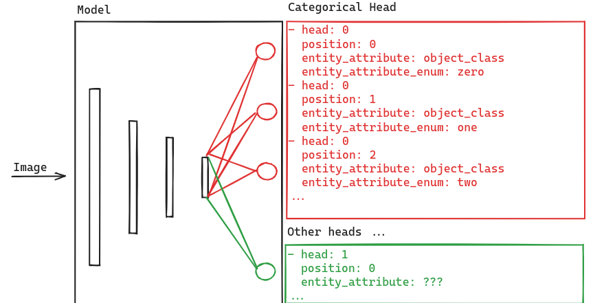

+++
title = "Creating your first assessment capability"
description = "A tutorial on how to create your first assessment capability, add it to an agent and run in an assessment process"
date = 2021-05-01T08:00:00+00:00
updated = 2021-05-01T08:00:00+00:00
draft = false
weight = 400
sort_by = "weight"
template = "docs/page.html"

[extra]
lead = "A tutorial on how to create your first assessment capability, add it to an agent and run in an assessment process"
toc = true
top = false
+++

## Overview

The following tutorial will walk you through creating an *Assessment Capability* in
Highlighter. Each step in this tutorial can by carried out in you Highlighter
account. Although we will be building a toy example, the tutorial wll link to
other explanations/references as needed.

## Prerequisites

  - **Labelled data**: For this tutorial we will be using a Street Number
detection dataset. To import it into your account click [here](ToDo). Otherwise
you can just follow along and fill-in-the-blanks with your own data.

## What Is An *Assessment Capability*

> Assessments tasks are sub-tasks of a larger assessment process that an organisation wishes to carry out.

More information on Capabilities [here](../concepts/capabilities.md#assments)

## Steps

1. [Identify The Taxonomy](#identify-the-taxonomy) and create as needed
2. [Create A Model](#create-a-model) that outputs the desired taxa
3. [Create An Experiment](#create-an-experiment) to track your model training
4. [Configure Training Run](#configure-training-run) and click `Train`


## Identify The Taxonomy

When working in an extablished account you may have an existing taxonomy
defined. In this case you may be able to skip to the [Create A
Model](#create-a-model) step.

For this tutorial we will be creating a street number detector. The detector
will take images as input and return an enum attribute indicating the digit
(0-9) and a pixel location attribute. For example:


For this we will need to create 10 *Object Classes* in Highlighter to represent each
digit. 

  - In the Highlighter UI, click the *Develop* tab in the top ribbon
  - Click the *Taxonomy* tab on the Highlighter side bar
  - Click the *New Object Class* button
  - Fill in the form (using Zero as an example):
    - **Name**: Zero`
    - **Description**: The digit zero
    - **Color**: YOU CHOOSE
    - **Include in projects by default?**: ☐  UNCHECK!
  - Click `Save Object Class`

## Create A Model

A *Model* in Highlighter represents a transformation from some input to some
output. Importantly, it does not specify *how* the transformation is performed.
For the programmers among you, a *Model* serves as an Interface.

**Create a new Model**, You'll need to do this in the admin for now

  - Login into Highlighter admin
  - `Capabilities->Models->New Model`
  - **Name**: Street Number Detector
  - **Description**: Detects the location of street numbers within an image and classifies each digit from 0-9
  - **Leave the rest of the fields as is. We are currently in the process of refactoring this part of Highlighter and need to do some cleaning up.**
  - Click `Create Model`
  - Stay on this page for the next steps


### Model Inputs

The *Model*'s inputs serve two functions depending on where they're being used.
At training time they inform the Dataset manipulations needed to convert the 
Highlighter Dataset Submissions into a form the model Trainer can use. At
inference time they tell the Pipeline what data to pass to the model. For more
information about Model Inputs see [here](../concepts/model-inputs-and-outputs.md).

In our case the *Model* we're creating is a Detector. It takes images as an
input. At the moment an input image is assumed. Also, a Detector expects a full
image so no filtering is required.

### Model Output

The *Model*'s outputs also serve two functions depending on where they're being
used. At training time that are used in conjunction with the Model Inputs to
convert the Highlighter Dataset Submissings into a form the model Trainer can use.
At inference time they tell the Pipeline what attribtues the Pipeline Element
is producing.

In our case we're creating a single headed *Model*. With `head 0` producing 10
*Object Class* attributes (one for each digit 0-9) and a pixel location
attribute representing the bounding box contaning each digit.



**At the moment the pixel_location attribute is infered within the code and has
not been made explicit so we need only add the *Object Class* attributes to the
Model Outputs.**.

**Add Model Outputs**

  - From the Model page you landed on from the previous step. Do this once for each digit 0-9
  - In the *Actions* box on the right click, `Manage Model Outputs->New Model Output`
  - **Head**: 0
  - **Position**: 0  *increment for each digit 0-9*
  - **Entity Attribute**: object_class
  - **Entity Attribute Enum**: zero *select the appropriate object class*
  - **Default Threshold**: 0.5
  - Click `Create Model Output`

## Create An Experiment

Highlighter uses *Experiments* to track model training. Typically you would like
to iteratively improve a model by running several training runs. Highlighter requires
you group *Experiments* under a a *Research Plan*. The *Research Plan* provides 
a place to record high level objectives and aggregate performance metrics. Whereas
*Experiments* provide a place for the more detailed investigations. 

We recomend an *Experiment* contains a single *Training Run*, this avoids confusion
when inspecting performance metrics.

  - Research Plan: (Street Number Detection)
    - Experiment00: (Baseline: train model using default settings)
      - TrainingRun00 (Model Template: `Detector DETR Resnet50`)
      - Metrics ...
    - Experiment01: (V1: Increased batch size to reduce loss noise)
      - TrainingRun01 (Model Template: `Detector DETR Resnet50`)
      - Metrics ...
    - ...

**The following instructions are in the Highlighter Frontend UI**

**Create Research Plan**


  - In the Highlighter UI, click the *Develop* tab in the top ribbon
  - `Research Plans->New Research Plan`
    - **Title**: Street Number Detector
    - **Description**: Tutorial
    - **Objective**: To develop a model capable of locating street numbers in images
    and classifying the digit (0-9)
    - **Evaluation Process**: ToDo
    - **Assigned To**: YOU
    - **Add Metrics**: ToDo
    - Click `Save Research Plan`

**Create Experiment**

  - From the *Street Number Detector Research Plan* page
  - `Experiments->New Experiment`
    - **Title**: Baseline
    - **Description**: Train model using default settings
    - **Hypothesis**: 🤷
    - **Assigned To**: YOU
    - Click `Save Experiment`
    - Note the experiment id in the url: `https://demo.highlighter.ai/research_plans/123/experiments/456`


## Configure Training Run

We're on the home strech!!!

The *Training Run* is where you select the *Model Template*
to use and configure the various parameters. Some parameters are common to several
templates and some are unique to a specific template. See the [Model Template](ToDo) reference for
the specifics of each.

### Select a Model Config Template

*Model Config Templates* are `.json` files with placeholders for some variables.
Creating a *Modle Config Template* is out of the scope of this tutorial, for
more information on the see the [Creating a Model Config Template](creating-a-model-config-template.md) tutorial.

For now, we will simply use `Detector DETR Resnet50`. This template
configures the Trainer to train a DETR model. For more information on DETR see
[End-to-End Object Detection with Transformers](https://arxiv.org/abs/2005.12872)


**Configure Training Run**

  - In the Highlighter UI, click the *Develop* tab in the top ribbon
  - `Training->Train New Model`
  - **Name**: Street Number Detector 00
  - **Model**: Street Number Detector
  - **Add Dataset**:
    - **Purpos**: train
    - *Dataset**: `street-numbers-demo-train-0.8`
  - **Add Dataset**:
    - **Purpos**: dev
    - *Dataset**: `street-numbers-demo-test-0.2`
  - **Add Dataset**:
    - **Purpos**: test
    - *Dataset**: `street-numbers-demo-test-0.2`
  - **Model Template**: `Detector DETR Resnet50` You can view the full template by clicking `Detail`
  - **Config Overide**: (see `json` blob below). The Config Override dict is merged with the Model Template prior to training.
    - `num_classes`: Set the number of classes to 10
    - `max_epochs`: Set the number of epochs to train for, for brevity lets say `5`
  - Click `Train`

```json
{
  "model": {
    "bbox_head": {
      "num_classes": 10
    }
  },
  "train_cfg": {
    "max_epochs": 5
  }
}
```

### Optional Override Default Highlighter Dataset Preprocessing Operations


Highlighter Datasets typically contain more attributes than a specific model
needs at training time, ie: We may be training cat and dog detector but the
dataset also has trees and cars. To perform this filtering we have
`DatasetPreprocessor` class that can run a sequence of operations (ops). See
the [hl_train/highlighter_dataset/ops.py](../references/hl_train/highlighter_dataset_preprocessor_ops/index.html)
reference for all the common operations.

You can set your own pre-processing ops by setting the `HIGHLIGHTER_DATASET_PREPROCESSING`
key-value-pair in the `Model Config Overrides`. The configured ops can be told to
run `before` or `after` the default ops, or, you can `delete` the default ops
and only use the ops you manually configure.

For eaxample:

To drop some corrupt images from the Dataset you could add the following. To
drop the images before the default ops are run.

```json
{
  "HIGHLIGHTER_DATASET_PREPROCESSING": {
      "when": "before",
      "ops": [{"type": "DropImages",
               "image_ids": [12345, 67890]
            }]
 }

```

